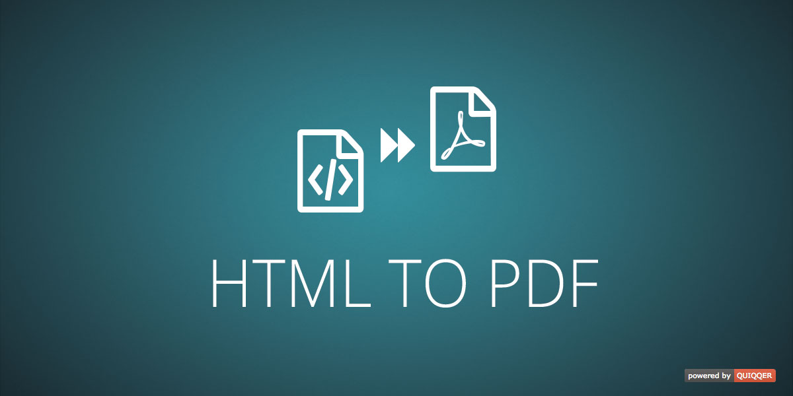

QUIQQER HTML to PDF
========

This plugin allows the conversion from HTML to PDF. Set separate HTML files for the PDF header, body and footer. Works with `wkhtmltopdf`.

Package Name:

    quiqqer/htmltopdf


Features
--------
* Convert HTML to PDF files
* Use simple HTML and CSS to style your PDFs
* Separate HTML files and CSS files for PDF header, body and footer (optional)
* Show page numbers in your PDF footer

Installation
------------
The Package Name is: quiqqer/htmltopdf

### Dependencies
* **wkhtmltopdf** - included in this package; s. http://wkhtmltopdf.org/downloads.html
* Further packages that **wkhtmltopdf** requires:
  * `sudo apt-get install zlib1g-dev`
  * `sudo apt-get install fontconfig fontconfig-config`
  * `sudo apt-get install libfreetype6`
  * `sudo apt-get install libx11-dev libxext-dev libxrender-dev`

Usage
----------
```php
$Document = new \QUI\HtmlToPdf\Document();

$Document->setHeaderHTML('<div class="header-test"><p>I am a header</p></div>');

$Document->setContentHTML('<div class="body-test">I am THE body</div>');
$Document->setContentCSS('.body-test { color: #ABC123; }');
$Document->addContentCSSFile('/tmp/test.css');

$Document->setFooterHTML('<div class="footer-test">I am a footer</div>');
$Document->setFooterCSS('.footer-test { color: #CFE123; }');

// create PDF file
$pdfFile = $Document->createPDF();

// Download PDF file
$Document->download();
```

For the settings for the `\QUI\HtmlToPdf\Document` class see the [Wiki](https://dev.quiqqer.com/quiqqer/htmltopdf/wikis/settings)

Contribute
----------
- Project: https://dev.quiqqer.com/quiqqer/htmltopdf
- Issue Tracker: https://dev.quiqqer.com/quiqqer/htmltopdf/issues
- Source Code: https://dev.quiqqer.com/quiqqer/htmltopdf/tree/master

Support
-------
If you found any errors or have wishes or suggestions for improvement,
please contact us by email at support@pcsg.de.

We will transfer your message to the responsible developers.

License
-------
PCSG QL-1.0, CC BY-NC-SA 4.0