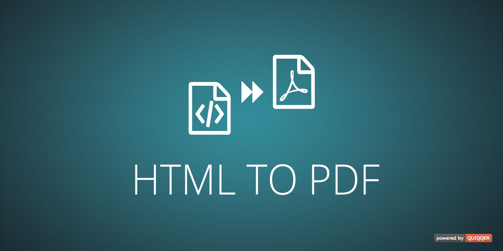

QUIQQER HTML to PDF
========

This plugin allows the conversion from HTML to PDF. Set separate HTML files for the PDF header, body and footer.
Additionally, PDF files can be directly converted to images.

Package Name:

    quiqqer/htmltopdf

Features
--------
* Convert HTML to PDF files
* Convert PDF files to image(s)
* Use simple HTML and CSS to style your PDFs
* Separate HTML files and CSS files for PDF header, body and footer (optional)
* Show page numbers in your PDF footer
* Comes with two providers:
  * mpdf (https://mpdf.github.io/) - runs natively in PHP and does not require external dependencies
  * chrome-headless (https://github.com/chrome-php/chrome) - runs in a headless Chrome browser (requires Chrome 65+ to be installed)

Installation
------------
The Package Name is: quiqqer/htmltopdf

### Chrome and AppArmor

The Chrome executable must be runnable by the PHP-FPM process. A filesystem
permission check alone is not sufficient because mandatory access control
systems such as AppArmor or SELinux can still deny process execution.

On Ubuntu systems using the AppArmor profiles `php-fpm` and `chrome`, the
following local rule permits PHP-FPM to start the Google Chrome wrapper and
transition to the dedicated Chrome profile:

```text
/opt/google/chrome/google-chrome Px -> chrome,
```

Add the rule to `/etc/apparmor.d/local/php-fpm` and reload the profile:

```bash
sudo apparmor_parser -r /etc/apparmor.d/php-fpm
```

The provider requirements check starts Chrome with `--version`. If execution
is blocked, the settings test reports the executable path, exit code, and a
hint to check AppArmor, SELinux, or PHP-FPM service restrictions.

Chrome's sandbox and TLS certificate validation are enabled by default. If a
restricted server or container cannot start Chrome with its sandbox, the
`Disable Chrome sandbox` setting adds `--no-sandbox`. This weakens process
isolation and should only be enabled when the surrounding runtime provides an
equivalent security boundary. The separate `Ignore TLS certificate errors`
setting should only be used for controlled internal resources with certificates
that cannot be validated normally.

Usage
----------

```php
$document = new \QUI\HtmlToPdf\Document();

$document->setHeaderHTML('<div class="header-test"><p>I am a header</p></div>');

$document->setContentHTML('<div class="body-test">I am THE body</div>');
$document->setContentCSS('.body-test { color: #ABC123; }');
$document->addContentCSSFile('/tmp/test.css');

$document->setFooterHTML('<div class="footer-test">I am a footer</div>');
$document->setFooterCSS('.footer-test { color: #CFE123; }');

$handler = new \QUI\HtmlToPdf\Handler();
$pdfCreator = $handler->getPdfCreator();

// create PDF file
$pdfFile = $pdfCreator->createPdf($document);

// Download (and save) PDF file
$pdfFile = $pdfCreator->createAndDownloadPdf($document, true);

// Convert PDF to imgage(s)
$pdfAsImages = $pdfCreator->createPdfAndConvertToImage($document);
```

## Version 4

Version 4 constitutes a major overhaul and cleanup of the plugin code base.

Read everything important in the wiki:  
https://dev.quiqqer.com/quiqqer/htmltopdf/-/wikis/version-4

Contribute
----------
- Project: https://dev.quiqqer.com/quiqqer/htmltopdf
- Issue Tracker: https://dev.quiqqer.com/quiqqer/htmltopdf/issues
- Source Code: https://dev.quiqqer.com/quiqqer/htmltopdf/tree/master

Support
-------
If you found any errors or have wishes or suggestions for improvement,
please contact us by email at support@pcsg.de.

We will transfer your message to the responsible developers.

License
-------
PCSG QL-1.0, CC BY-NC-SA 4.0
